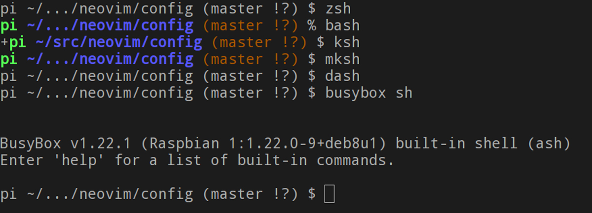

# Polyglot Prompt

*Polyglot Prompt supports seven shells: `zsh`, `bash`, `ksh`, `mksh`, `pdksh`, `dash`, and `busybox sh`*

*In `zsh` and in `bash` v4.3 and higher the prompt alters in appearance when the line editor is in `vi` command mode. In `zsh` the exit status is displayed in the right prompt.*

**Polyglot Prompt** is a dynamic color prompt for `zsh`, `bash`, `ksh93`, `mksh`, `pdksh`, `dash`, and `busybox sh` (`ash`) that displays the current directory's Git branch and indicates any changes to it. It uses basic ASCII symbols to do so, not Unicode glyphs, so it works with more fonts. An SSH connection is indicated by the presence of a hostname in the prompt; local connections only show a username. In `zsh` and in `bash` v4.3 and higher, Polyglot Prompt has the added feature of altering the appearance of the prompt when in vi command mode. In `zsh` the exit code is displayed in the right prompt; in `bash` it appears near the end of the left prompt.

The symbols that Polyglot Prompt uses to represent Git status are as follows:

Git Status | Symbol
--- | ---
Modified | !
Deleted | x
Untracked | ?
New file(s) | +
Ahead | \*
Renamed | >

Polyglot Prompt emulates bash's PROMPT_DIRTRIM=2 behavior in all other shells, so that

	$HOME/src/neovim/config

is abbreviated as

	~/.../neovim/config

and

	/usr/share/vim/vim80

is shortened to

	.../vim/vim80

Polyglot Prompt can be used without any shell framework and can be loaded thus:

     . /path/to/polyglot.sh

If you do use a framework, consult its documentation to see how you can load Polyglot Prompt. For `zsh`, I use [zplugin](https://github.com/zdharma/zplugin), so my `.zshrc` has the line

    zplugin load agkozak/polyglot
